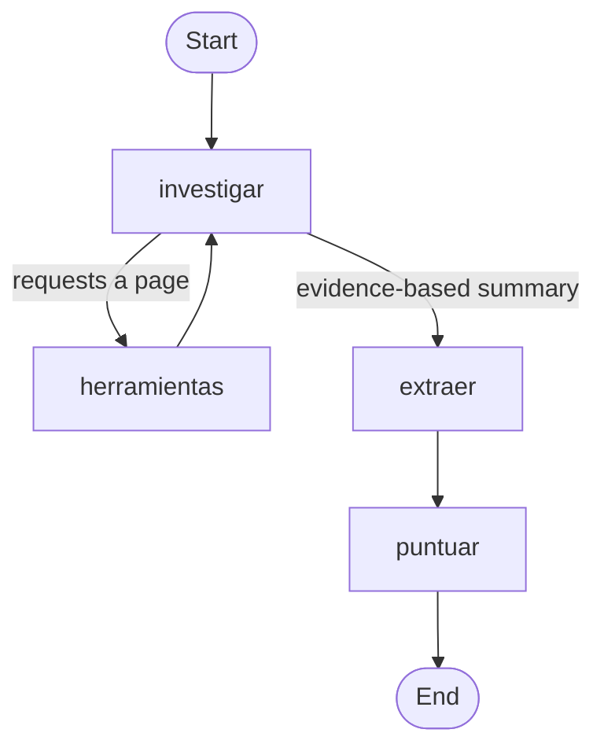

# Lead qualification agent with LangGraph

🇪🇸 [Español](README.md) · 🇬🇧 **English**

An AI agent that researches a company's website, extracts verifiable data and decides whether it is a good potential client for a marketing agency specialised in local businesses in Madrid.

---

## The problem

A marketing agency receives leads every day: someone downloads a guide, requests an audit or subscribes to the newsletter. Qualifying them by hand means visiting each company's website, finding out what it does, where it is and how many locations it has, and deciding whether it is worth contacting. It is repetitive work that can take several minutes per lead.

This agent does it automatically, in a few seconds and for less than one cent per lead.

## Example

**Input:**
```
Web: https://clinicaceodent.es/. Ha descargado nuestra guía de SEO local.
```
*(The lead downloaded our local SEO guide.)*

**What the agent does:** it visits the home page, decides on its own which other pages are likely to contain the missing information (contact, about the clinic), and summarises what it found by copying the evidence literally from the website:

```
SECTOR: Clínica dental, odontología integral, ortodoncia, implantes...
CIUDADES CON SEDES: Madrid
NÚMERO DE SEDES SEGÚN LA WEB: no aparece
DIRECCIONES ENCONTRADAS: Av. de San Luis, 54 (Esq. Luis Buitrago) 28033 Madrid
DATOS NO CONFIRMADOS: número exacto de sedes
```
*(Sector: dental clinic · Cities with locations: Madrid · Number of locations stated on the website: not found · Addresses found: one in Madrid · Unconfirmed: exact number of locations.)*

**Result:**
```
Datos: sector='salud' numero_sedes=1 en_madrid=True intencion='media'
Puntuación: 7 → nutrir
```
*(Health sector, 1 location, in Madrid, medium intent → score 7 → nurture.)*

---

## How it works

The agent is a LangGraph graph built node by node:



| Node | What it does | Uses AI? |
|---|---|---|
| `investigar` (research) | Decides which page to read next or writes the final evidence-based summary | Yes |
| `herramientas` (tools) | Downloads the page and returns its text and links | No |
| `extraer` (extract) | Turns the summary into structured data (Pydantic) | Yes |
| `puntuar` (score) | Applies the business rules and decides the action | No |

---

## Design decisions

**The AI extracts, the code decides.** AI is only used for what it does better than code: understanding messy text. Scoring and the final decision are Python rules: always consistent, explainable point by point, free to run and covered by tests. Changing a business criterion means changing a number, without touching the agent.

**Evidence instead of conclusions.** Instead of asking the AI "how many locations does it have?", it is asked to literally copy the addresses or the sentence on the website that states it. If it finds nothing, it must say "not found" rather than infer it. This stopped the agent from asserting data with little evidence (for example, "1 location" after reading only the home page).

**Ask only for the data the decision needs.** An early rule that counted addresses failed with a gym chain with dozens of clubs (it said "1 location"). Since the decision only needs to know the range of locations, the definition of evidence was broadened: a statement from the company itself is worth more than counting addresses.

**Important limits live in the code.** The maximum number of pages per lead does not depend on the AI "obeying" the instructions: when the limit is reached, the code removes its ability to use tools (`tool_choice="none"`).

**One job per node.** `investigar` and `extraer` are separate. `extraer` only reads the final summary, not the full pages, which greatly reduces the number of tokens.

### Business rules (ideal customer profile)

| Criterion | Points |
|---|---|
| **Requirement:** having a location in Madrid | If not → 0 points and discard |
| Sector: health, beauty, hospitality or education | +3 |
| Location in Madrid | +2 |
| Between 2 and 10 locations | +2 |
| High / medium / low intent | +3 / +2 / +0 |

**8 or more → contact · 5 to 7 → nurture · below 5 → discard**

The 10-location cap exists because a very large chain usually has its own marketing department and is not the ideal client for a local agency.

---

## Quality

### Tests
87 `pytest` tests that run in under a second and at no cost:
- **Business rules:** scoring and decisions, including edge cases (the boundaries between actions, unknown number of locations, the 10-location cap, leads outside Madrid).
- **Dataset consistency:** they recompute the action of every lead in the dataset using the rules, so that a correct answer written down wrongly by hand cannot make the agent "fail" through no fault of its own.

### Agent evaluation
A LangSmith dataset with **35 real leads** from Spanish businesses. The correct answer for each one (sector, whether it is in Madrid, range of locations, intent and action) was verified by reading the company's website, and each lead stores the **literal quote and URL** that back it up. Five evaluators check each field separately.

The dataset is designed to cover every case, not just the easy ones:
- All 5 sectors, businesses inside and outside Madrid, and chains with locations in Madrid and other cities.
- One location, 2 to 10, more than 10 and unknown; all three intent levels.
- A balanced mix of actions (13 contact · 10 nurture · 12 discard) and cases right on the boundary between actions (4/5 and 7/8 points).
- **Deliberately hard cases:** data at the end of very long pages, addresses that only appear on the contact page, home-visit businesses with no premises, websites with very little text, and traps such as a Barcelona gym called "DiR Av. Madrid" or a Valencia beauty salon on Salamanca Street.

| Version | Correct action |
|---|---|
| Before the improvements (`grafo-v3`) | 90% |
| Final version (`grafo-v5`), 3 runs | 34, 35 and 35 out of 35 → **99%** |

The only error in the final version was the "DiR Av. Madrid" trap, which the agent once mistook for a location in Madrid.

Each lead takes between 5 and 20 seconds, depending on how many pages the agent needs to visit.

Something I learned by measuring: most of the tokens are **input** tokens, because the whole conversation is resent on every turn of the agent loop. Results also vary between runs of the same agent (the model does not always answer the same way and websites sometimes fail to respond), so I use several runs to report a figure and compare versions.

### Improvement cycles

**1. A business rule.** The first dataset revealed that a language school in Barcelona was classified as "contact" for a Madrid agency. It was fixed as follows:
1. **Test** describing the desired behaviour (fails).
2. **Code:** a guard clause in the scoring function (tests pass).
3. **Dataset** updated with the new correct answer.
4. **Evaluation** of the new version, compared with the previous one in LangSmith, checking that only the expected results changed.

**2. From 90% to 99%.** After expanding the dataset with real, hard leads, I went through every failure in the LangSmith traces and separated the agent's errors from errors in the labels themselves:

| Observed failure | Cause | Fix |
|---|---|---|
| Missed addresses on long pages | The tool cut the text at 4,000 characters | Read the beginning and the end of the page, where the footer with the address usually is |
| Placed a business in Madrid although its website names no city | The model was guessing the city | If the website does not name it, write "not found" |
| Counted 1 location for a chain of 21 restaurants | It only counted full addresses | Also count the locations the website lists by name |
| Gyms classified as healthcare | The `sector` field had no criteria | Define what belongs in each sector |
| Unreadable accents ("á") | Websites that do not declare their encoding | Detect the encoding |
| A website did not load during the evaluation | Temporary website failure | Retry once |

The evaluation also helped **clean up the dataset**: I corrected some labels and removed two leads whose number of locations was ambiguous even for a person (in one of them the agent had read the website better than I had).

---

## Tech stack

Python 3.13 · LangChain · LangGraph · OpenAI (GPT-4.1 mini) · Pydantic · LangSmith (tracing and evaluation) · pytest · Requests · BeautifulSoup · Poetry

---

## Project structure

```
├── leads/                      ← lead qualification agent
│   ├── agente_grafo.py         ← the agent (LangGraph graph)
│   ├── evaluar_lead.py         ← data schema and business rules
│   └── evaluaciones/           ← LangSmith dataset and evaluation
├── auditoria/                  ← acquisition audit agent (in progress)
├── compartido/
│   └── herramientas.py         ← web reading tool, shared by the agents
├── tests/                      ← tests for the rules and dataset consistency
└── ejemplos/                   ← learning scripts and a create_agent version (for comparison)
```

*The code, prompts and data are in Spanish, as the agent targets Spanish businesses.*

---

## Installation and usage

**Requirements:** Python 3.11 or later, Poetry, an OpenAI API key and, optionally, a LangSmith API key.

```bash
git clone https://github.com/albarodriguez7/AgentesIA_Marketing.git
cd AgentesIA_Marketing
poetry install
```

Copy `.env.example` to `.env` and fill in your keys.

| I want to... | Command |
|---|---|
| Qualify an example lead | `poetry run python -m leads.agente_grafo` |
| Run the tests | `poetry run pytest` |
| Upload the dataset to LangSmith | `poetry run python -m leads.evaluaciones.crear_dataset` |
| Run the evaluation (requires LangSmith) | `poetry run python -m leads.evaluaciones.evaluar_agente experiment-name` |

---

## Next steps

- Reduce cost by removing the repeated text (menus and links) resent on every turn, and measure the savings with the dataset.
- Have `investigar` return its summary as structured data instead of labelled text.
- Tell streets and venues named after a city ("DiR Av. Madrid") apart from real cities, the only remaining error.
- Keep growing the evaluation dataset with every real case where the agent fails.
- Next modules of the platform: acquisition audit, metrics and retention.

---

## Author

Project developed as part of my training as an AI Engineer.

- LinkedIn: [my profile](https://www.linkedin.com/in/albarodriguezperales/)
- GitHub: [my projects](https://github.com/albarodriguez7)
