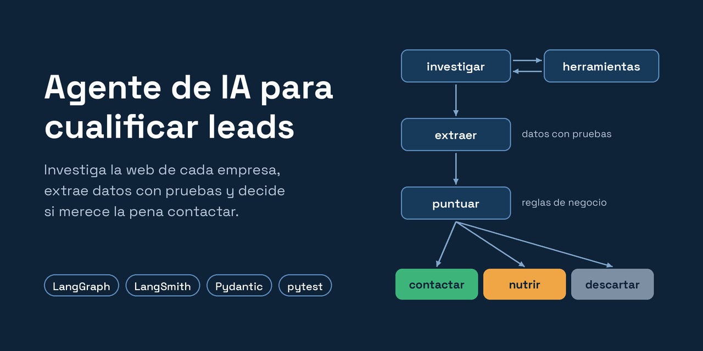

# Agente de cualificación de leads con LangGraph


🇪🇸 **Español** · 🇬🇧 [English](README.en.md)

Agente de IA que investiga la web de una empresa, extrae datos verificables y decide si es un buen cliente potencial para una agencia de marketing de negocios locales de Madrid.

---

## El problema

Una agencia de marketing recibe leads a diario: alguien descarga una guía, pide una auditoría o se suscribe a la newsletter. Cualificarlos a mano significa entrar en la web de cada empresa, averiguar a qué se dedica, dónde está y cuántos centros tiene, y decidir si merece la pena contactar. Es un trabajo repetitivo que puede llevar varios minutos por lead.

Este agente lo hace de forma automática, en unos segundos y por menos de un céntimo por lead.

## Ejemplo

**Entrada:**
```
Web: https://clinicaceodent.es/. Ha descargado nuestra guía de SEO local.
```

**Lo que hace el agente:** visita la portada, decide por sí mismo qué otras páginas pueden tener la información que le falta (contacto, la clínica), y resume lo que ha encontrado copiando las pruebas literalmente de la web:

```
SECTOR: Clínica dental, odontología integral, ortodoncia, implantes...
CIUDADES CON SEDES: Madrid
NÚMERO DE SEDES SEGÚN LA WEB: no aparece
DIRECCIONES ENCONTRADAS: Av. de San Luis, 54 (Esq. Luis Buitrago) 28033 Madrid
DATOS NO CONFIRMADOS: número exacto de sedes
```

**Resultado:**
```
Datos: sector='salud' numero_sedes=1 en_madrid=True intencion='media'
Puntuación: 7 → nutrir
```

---

## Cómo funciona

El agente es un grafo de LangGraph construido nodo a nodo:


| Nodo | Qué hace | ¿Usa IA? |
|---|---|---|
| `investigar` | Decide qué página leer o escribe el resumen final con pruebas | Sí |
| `herramientas` | Descarga la página y devuelve su texto y sus enlaces | No |
| `extraer` | Convierte el resumen en datos estructurados (Pydantic) | Sí |
| `puntuar` | Aplica las reglas de negocio y decide la acción | No |

---

## Decisiones de diseño

**La IA extrae, el código decide.** La IA se usa solo para lo que hace mejor que el código: entender texto desordenado. La puntuación y la decisión final son reglas en Python: siempre coherentes, explicables punto por punto, gratuitas y comprobables con tests. Cambiar un criterio de negocio es cambiar un número, sin tocar el agente.

**Pruebas en vez de conclusiones.** En lugar de preguntar a la IA "¿cuántas sedes tiene?", se le pide que copie literalmente las direcciones o la frase de la web que lo indique. Si no encuentra nada, debe decir "no aparece" en lugar de deducirlo. Esto evitó que el agente afirmara datos con poca evidencia (por ejemplo, "1 sede" leyendo solo la portada).

**Pide solo el dato que la decisión necesita.** Una regla inicial que contaba direcciones falló con una cadena de gimnasios con decenas de clubes (dijo "1 sede"). Como la decisión solo necesita saber el tramo de sedes, se amplió qué cuenta como prueba: una frase de la propia empresa vale más que contar direcciones.

**Los límites importantes van en el código.** El máximo de páginas por lead no depende de que la IA "obedezca" las instrucciones: al llegar al límite, el código le retira la posibilidad de usar herramientas (`tool_choice="none"`).

**Cada nodo, un solo trabajo.** `investigar` y `extraer` están separados. `extraer` solo lee el resumen final, no las páginas completas, lo que reduce mucho el número de tokens.

### Reglas de negocio (perfil de cliente ideal)

| Criterio | Puntos |
|---|---|
| **Requisito:** tener sede en Madrid | Si no → 0 puntos y descartar |
| Sector: salud, estética, hostelería o educación | +3 |
| Sede en Madrid | +2 |
| Entre 2 y 10 sedes | +2 |
| Intención alta / media / baja | +3 / +2 / +0 |

**8 o más → contactar · 5 a 7 → nutrir · menos de 5 → descartar**

El techo de 10 sedes existe porque una cadena muy grande suele tener su propio departamento de marketing y no es el cliente ideal de una agencia local.

---

## Calidad

### Tests
87 tests con `pytest` que se ejecutan en menos de un segundo y sin coste:
- **Reglas de negocio:** la puntuación y la decisión, incluidos los casos límite (las fronteras entre acciones, sedes desconocidas, el techo de 10 sedes, leads fuera de Madrid).
- **Coherencia del dataset:** recalculan la acción de cada lead del dataset con las reglas, para que una respuesta correcta mal apuntada a mano no haga "fallar" al agente sin tener la culpa.

### Evaluación del agente
Dataset en LangSmith con **35 leads reales** de empresas españolas. La respuesta correcta de cada uno (sector, si está en Madrid, tramo de sedes, intención y acción) está comprobada leyendo la web de la empresa, y cada lead guarda la **cita literal y la URL** que la justifican. Cinco evaluadores comprueban cada campo por separado.

El dataset está diseñado para cubrir todos los casos y no solo los fáciles:
- Los 5 sectores, empresas en Madrid y fuera, y cadenas con sedes en Madrid y en otras ciudades.
- Una sede, de 2 a 10, más de 10 y número desconocido; los tres niveles de intención.
- Reparto equilibrado de acciones (13 contactar · 10 nutrir · 12 descartar) y casos en la frontera entre acciones (4/5 y 7/8 puntos).
- **Casos difíciles a propósito:** datos al final de páginas muy largas, direcciones que solo están en la página de contacto, negocios a domicilio sin local, webs con muy poco texto y trampas como un gimnasio de Barcelona llamado "DiR Av. Madrid" o un centro de estética de Valencia en la calle Salamanca.

| Versión | Acción correcta |
|---|---|
| Antes de las mejoras (`grafo-v3`) | 90 % |
| Versión final (`grafo-v5`), 3 ejecuciones | 34, 35 y 35 de 35 → **99 %** |

El único fallo de la versión final fue el caso trampa "DiR Av. Madrid", que el agente confundió una vez con una sede en Madrid.

Cada lead tarda entre 5 y 20 segundos, según cuántas páginas necesite visitar el agente.

Algo que aprendí midiendo: la mayor parte de los tokens son de **entrada**, porque en cada vuelta del agente se reenvía toda la conversación. Y los resultados varían entre ejecuciones del mismo agente (el modelo no responde siempre igual y las webs a veces no responden), así que para dar una cifra y comparar versiones uso varias ejecuciones.

### Ciclos de mejora

**1. Una regla de negocio.** El primer dataset reveló que una academia de Barcelona salía como "contactar" para una agencia de Madrid. Se corrigió así:
1. **Test** que describe el comportamiento deseado (falla).
2. **Código:** una cláusula de guarda en la puntuación (los tests pasan).
3. **Dataset** actualizado con la nueva respuesta correcta.
4. **Evaluación** de la nueva versión y comparación con la anterior en LangSmith, comprobando que solo cambiaba lo esperado.

**2. Del 90 % al 99 %.** Al ampliar el dataset a leads reales y difíciles, analicé uno a uno los fallos en las trazas de LangSmith y separé los errores del agente de los errores de las propias etiquetas:

| Fallo observado | Causa | Corrección |
|---|---|---|
| No veía direcciones de páginas largas | La herramienta cortaba el texto en 4.000 caracteres | Leer el principio y el final de la página, donde suele estar el pie con la dirección |
| Situaba en Madrid a un negocio cuya web no nombra ninguna ciudad | El modelo deducía la ciudad | Si la web no la nombra, escribir "no aparece" |
| Contaba 1 sede en una cadena de 21 restaurantes | Solo contaba direcciones completas | Contar también los locales que la web lista por su nombre |
| Gimnasios clasificados como salud | El campo `sector` no tenía criterio | Definir qué entra en cada sector |
| Acentos ilegibles ("á") | Webs que no declaran su codificación | Detectar la codificación |
| Una web no cargó durante la evaluación | Fallo puntual de la web | Reintentar una vez |

La evaluación también sirvió para **depurar el dataset**: corregí algunas etiquetas y quité dos leads cuyo número de sedes era ambiguo incluso para una persona (en uno de ellos el agente había leído la web mejor que yo).

---

## Tecnologías

Python 3.13 · LangChain · LangGraph · OpenAI (GPT-4.1 mini) · Pydantic · LangSmith (tracing y evaluación) · pytest · Requests · BeautifulSoup · Poetry

---

## Estructura del proyecto

```
├── leads/                      ← agente de cualificación de leads
│   ├── agente_grafo.py         ← el agente (grafo de LangGraph)
│   ├── evaluar_lead.py         ← formulario de datos y reglas de negocio
│   └── evaluaciones/           ← dataset y evaluación en LangSmith
├── auditoria/                  ← agente de auditoría de captación (en desarrollo)
├── compartido/
│   └── herramientas.py         ← herramienta para leer webs, común a los agentes
├── tests/                      ← tests de las reglas y de coherencia del dataset
└── ejemplos/                   ← scripts de aprendizaje y agente con create_agent (para comparar)
```

---

## Instalación y uso

**Requisitos:** Python 3.11 o superior, Poetry, una clave de API de OpenAI y, opcionalmente, una de LangSmith.

```bash
git clone https://github.com/albarodriguez7/AgentesIA_Marketing.git
cd AgentesIA_Marketing
poetry install
```

Copia `.env.example` como `.env` y rellena tus claves.

| Quiero... | Orden |
|---|---|
| Cualificar un lead de ejemplo | `poetry run python -m leads.agente_grafo` |
| Ejecutar los tests | `poetry run pytest` |
| Subir el dataset a LangSmith | `poetry run python -m leads.evaluaciones.crear_dataset` |
| Lanzar la evaluación (requiere LangSmith) | `poetry run python -m leads.evaluaciones.evaluar_agente nombre-del-experimento` |

---

## Próximos pasos

- Reducir el coste eliminando el texto repetido (menús y enlaces) que se reenvía en cada vuelta, y medir el ahorro con el dataset.
- Que `investigar` entregue su resumen como datos estructurados en lugar de texto con etiquetas.
- Distinguir calles y locales con nombre de ciudad ("DiR Av. Madrid") de las ciudades reales, el único fallo que queda.
- Seguir ampliando el dataset de evaluación con cada caso real en el que el agente falle.
- Siguientes módulos de la plataforma: auditoría de captación, métricas y retención.

---

## Autora

Proyecto desarrollado como parte de mi formación como AI Engineer.

- LinkedIn: [mi perfil](https://www.linkedin.com/in/albarodriguezperales/)
- GitHub: [mis proyectos](https://github.com/albarodriguez7)
