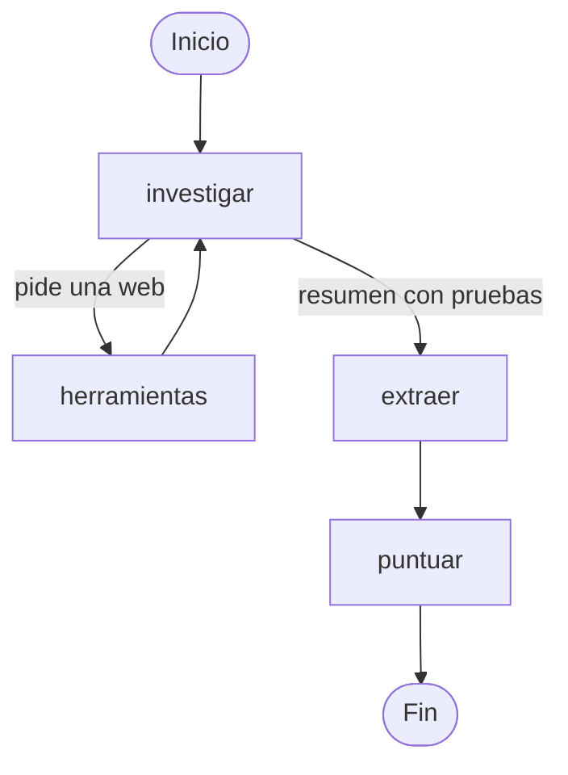

# Agente de cualificación de leads con LangGraph


🇪🇸 **Español** · 🇬🇧 [English](README.en.md)

Agente de IA que investiga la web de una empresa, extrae datos verificables y decide si es un buen cliente potencial para una agencia de marketing de negocios locales de Madrid.

---

## El problema

Una agencia de marketing recibe leads a diario: alguien descarga una guía, pide una auditoría o se suscribe a la newsletter. Cualificarlos a mano significa entrar en la web de cada empresa, averiguar a qué se dedica, dónde está y cuántos centros tiene, y decidir si merece la pena contactar. Es un trabajo repetitivo que puede llevar varios minutos por lead.

Este agente lo hace de forma automática, en unos segundos y por menos de un céntimo por lead.

## Ejemplo

**Entrada:**
```
Web: https://clinicaceodent.es/. Ha descargado nuestra guía de SEO local.
```

**Lo que hace el agente:** visita la portada, decide por sí mismo qué otras páginas pueden tener la información que le falta (contacto, la clínica), y resume lo que ha encontrado copiando las pruebas literalmente de la web:

```
SECTOR: Clínica dental, odontología integral, ortodoncia, implantes...
CIUDADES CON SEDES: Madrid
NÚMERO DE SEDES SEGÚN LA WEB: no aparece
DIRECCIONES ENCONTRADAS: Av. de San Luis, 54 (Esq. Luis Buitrago) 28033 Madrid
DATOS NO CONFIRMADOS: número exacto de sedes
```

**Resultado:**
```
Datos: sector='salud' numero_sedes=1 en_madrid=True intencion='media'
Puntuación: 7 → nutrir
```

---

## Cómo funciona

El agente es un grafo de LangGraph construido nodo a nodo:



| Nodo | Qué hace | ¿Usa IA? |
|---|---|---|
| `investigar` | Decide qué página leer o escribe el resumen final con pruebas | Sí |
| `herramientas` | Descarga la página y devuelve su texto y sus enlaces | No |
| `extraer` | Convierte el resumen en datos estructurados (Pydantic) | Sí |
| `puntuar` | Aplica las reglas de negocio y decide la acción | No |

---

## Decisiones de diseño

**La IA extrae, el código decide.** La IA se usa solo para lo que hace mejor que el código: entender texto desordenado. La puntuación y la decisión final son reglas en Python: siempre coherentes, explicables punto por punto, gratuitas y comprobables con tests. Cambiar un criterio de negocio es cambiar un número, sin tocar el agente.

**Pruebas en vez de conclusiones.** En lugar de preguntar a la IA "¿cuántas sedes tiene?", se le pide que copie literalmente las direcciones o la frase de la web que lo indique. Si no encuentra nada, debe decir "no aparece" en lugar de deducirlo. Esto evitó que el agente afirmara datos con poca evidencia (por ejemplo, "1 sede" leyendo solo la portada).

**Pide solo el dato que la decisión necesita.** Una regla inicial que contaba direcciones falló con una cadena de más de 380 gimnasios (dijo "1 sede"). Como la decisión solo necesita saber el tramo de sedes, se amplió qué cuenta como prueba: una frase de la propia empresa vale más que contar direcciones.

**Los límites importantes van en el código.** El máximo de páginas por lead no depende de que la IA "obedezca" las instrucciones: al llegar al límite, el código le retira la posibilidad de usar herramientas (`tool_choice="none"`).

**Cada nodo, un solo trabajo.** `investigar` y `extraer` están separados. `extraer` solo lee el resumen final, no las páginas completas, lo que reduce mucho el número de tokens.

### Reglas de negocio (perfil de cliente ideal)

| Criterio | Puntos |
|---|---|
| **Requisito:** tener sede en Madrid | Si no → 0 puntos y descartar |
| Sector: salud, estética, hostelería o educación | +3 |
| Sede en Madrid | +2 |
| Entre 2 y 10 sedes | +2 |
| Intención alta / media / baja | +3 / +2 / +0 |

**8 o más → contactar · 5 a 7 → nutrir · menos de 5 → descartar**

El techo de 10 sedes existe porque una cadena muy grande suele tener su propio departamento de marketing y no es el cliente ideal de una agencia local.

---

## Calidad

### Tests de las reglas
16 tests con `pytest` que comprueban la puntuación y la decisión, incluidos los casos límite (las fronteras entre acciones, sedes desconocidas, el techo de 10 sedes, leads fuera de Madrid). Se ejecutan en menos de un segundo y sin coste.

### Evaluación del agente
Dataset en LangSmith con 6 leads reales y la respuesta correcta comprobada a mano, elegidos para cubrir casos distintos: una sede, cadena pequeña, cadena enorme, fuera de Madrid, hostelería y un negocio a domicilio. Cuatro evaluadores comprueban por separado el sector, la ubicación, el tramo de sedes y la acción final.

| Métrica | Resultado |
|---|---|
| Aciertos | 6 de 6 en los cuatro evaluadores |
| Coste aproximado | ~0,005 $ por lead (GPT-4.1 mini) |
| Tiempo | 5 a 10 segundos por lead |

Algo que aprendí midiendo: alrededor del **97 % de los tokens son de entrada**, porque en cada vuelta del agente se reenvía toda la conversación. Y el coste varía bastante entre ejecuciones del mismo agente, así que para comparar versiones hay que usar varias ejecuciones.

### Un ciclo de mejora completo
El propio dataset reveló un fallo de las reglas: una academia de Barcelona salía como "contactar" para una agencia de Madrid. Se corrigió así:
1. **Test** que describe el comportamiento deseado (falla).
2. **Código:** una cláusula de guarda en la puntuación (los tests pasan).
3. **Dataset** actualizado con la nueva respuesta correcta.
4. **Evaluación** de la nueva versión y comparación con la anterior en LangSmith, comprobando que solo cambiaba lo esperado.

---

## Tecnologías

Python 3.13 · LangChain · LangGraph · OpenAI (GPT-4.1 mini) · Pydantic · LangSmith (tracing y evaluación) · pytest · Requests · BeautifulSoup · Poetry

---

## Estructura del proyecto

```
├── leads/                      ← agente de cualificación de leads
│   ├── agente_grafo.py         ← el agente (grafo de LangGraph)
│   ├── evaluar_lead.py         ← formulario de datos y reglas de negocio
│   └── evaluaciones/           ← dataset y evaluación en LangSmith
├── auditoria/                  ← agente de auditoría de captación (en desarrollo)
├── compartido/
│   └── herramientas.py         ← herramienta para leer webs, común a los agentes
├── tests/                      ← tests de las reglas
└── ejemplos/                   ← scripts de aprendizaje y agente con create_agent (para comparar)
```

---

## Instalación y uso

**Requisitos:** Python 3.11 o superior, Poetry, una clave de API de OpenAI y, opcionalmente, una de LangSmith.

```bash
git clone https://github.com/albarodriguez7/AgentesIA_Marketing.git
cd AgentesIA_Marketing
poetry install
```

Copia `.env.example` como `.env` y rellena tus claves.

| Quiero... | Orden |
|---|---|
| Cualificar un lead de ejemplo | `poetry run python agente_grafo.py` |
| Ejecutar los tests | `poetry run pytest` |
| Lanzar la evaluación (requiere LangSmith) | `poetry run python -m evaluaciones.evaluar_agente` |

---

## Próximos pasos

- Reducir el coste eliminando el texto repetido (menús y enlaces) que se reenvía en cada vuelta, y medir el ahorro con el dataset.
- Que `investigar` entregue su resumen como datos estructurados en lugar de texto con etiquetas.
- Ampliar el dataset de evaluación con cada caso real en el que el agente falle.
- Siguientes módulos de la plataforma: auditoría de captación, métricas y retención.

---

## Autora

Proyecto desarrollado como parte de mi formación como AI Engineer.

- LinkedIn: [mi perfil](https://www.linkedin.com/in/albarodriguezperales/)
- GitHub: [mis proyectos](https://github.com/albarodriguez7)
